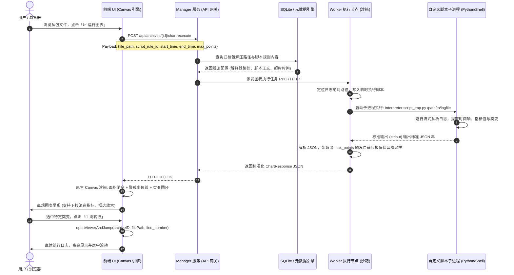

# 分布式存储日志分析系统 - 自定义时序解析脚本开发指南

本文档全面介绍**分布式存储日志分析系统**中的**自定义点位解析脚本（Custom Chart Script Engine）**功能，详细阐述脚本编写规范、前后端端到端交互架构原理、通信协议及实战样例。

---

## 目录
1. [功能概述与设计初衷](#1-功能概述与设计初衷)
2. [端到端交互原理与架构流程](#2-端到端交互原理与架构流程)
3. [自定义脚本开发规范与契约](#3-自定义脚本开发规范与契约)
4. [输出 JSON 数据协议详解](#4-输出-json-数据协议详解)
5. [多场景实战开发范例](#5-多场景实战开发范例)
   - [范例一：Linux iostat 磁盘利用率与突变识别 (Python)](#范例一linux-iostat-磁盘利用率与突变识别-python)
   - [范例二：Linux vmstat CPU与内存负载时序分析 (Python)](#范例二linux-vmstat-cpu与内存负载时序分析-python)
   - [范例三：极简 Shell/Awk 解析脚本 (零依赖)](#范例三极简-shellawk-解析脚本-零依赖)
6. [前端视觉渲染与双向穿透定位原理](#6-前端视觉渲染与双向穿透定位原理)
7. [常见问题排查 (FAQ)](#7-常见问题排查-faq)

---

## 1. 功能概述与设计初衷

在分布式存储系统（如 Ceph、GlusterFS、块存储集群等）与 Linux 服务器排障中，性能瓶颈（如磁盘堵塞、CPU 突刺、内存暴涨、网络抖动）往往呈现出**高频离散**的特征。常见的性能日志（如 `iostat -xz 1`、`vmstat 1`、`sar`、`ceph daemon perf dump` 等）包含数万至数十万行的连续采样数据。

**痛点**：
- 人工通过 `grep`、`less` 翻阅数万行数字日志极其耗时低效，难以捕捉瞬间性能抖动；
- 传统监控系统（如 Prometheus）受限于采样粒度（通常 15s~1m 周期），无法抓取到故障时刻秒级（甚至亚秒级）的突变细节。

**本系统解决方案**：
引入**分布式时序解析引擎与自定义脚本机制**：
1. **高度解耦与无限扩展**：系统不硬编码任何私有日志格式，运维人员只需提供一个简短的 Python/Shell/Perl 脚本；
2. **极速降采样（Peak-Preserving Downsampling）**：单小时包含数万点位的数据，后端自适应降采样至 1,500 像素级点位，保留所有极端突变毛刺；
3. **图表与日志深度联动**：图表不仅仅是展示，还能一键定位并**穿透直达原始日志文件的精确行号**，实现“看图发现异常 -> 一键跳转日志上下文分析原因”的闭环。

---

## 2. 端到端交互原理与架构流程

整个执行与渲染过程涵盖**浏览器前端、Manager 管理节点、Worker 执行节点、Python/Shell 子进程沙箱**，架构交互图如下：



### 核心步骤说明：
1. **触发与派发**：前端在日志文件列表中识别到匹配规则的文件，用户点击触发。Manager 将请求派发至该归档包所在的 Worker 节点。
2. **沙箱隔离执行**：Worker 节点以受控权限启动子进程，将目标日志文件的**宿主机绝对路径**作为第一个命令行参数（`sys.argv[1]` / `$1`）传给脚本。
3. **超时与安全防护**：脚本默认最大执行时长为 30 秒，超时将自动 SIGKILL 强行终止，防止死循环导致系统资源被占满。
4. **自适应降采样**：若脚本产出数万个采样点，Worker 的 `DownsampleSeries` 算法会自动基于最大最小极值桶（Bucket Min-Max）保留波峰与波谷，将其压缩至 `max_points`（默认 1,500），保证浏览器渲染帧率稳定在 60 FPS。
5. **双向协同定位**：突变事件携带 `line_number` 字段，前端通过该字段无缝穿透到日志全文阅读器。

---

## 3. 自定义脚本开发规范与契约

编写自定义脚本时，必须严格遵守以下契约：

### 1. 输入契约 (Input Contract)
- **命令行传参**：待解析的目标日志文件绝对路径通过**命令行第 1 个参数**传入：
  - Python: `log_file = sys.argv[1]`
  - Shell / Bash: `LOG_FILE="$1"`
- 脚本无需关心压缩包解压逻辑，系统已在执行前将归档包完整解压在本地磁盘中。

### 2. 输出契约 (Output Contract)
- **纯净 stdout 输出**：脚本有且仅能在标准输出（`stdout`）打印**一份合法的 JSON 字符串**。
- **禁止污染 stdout**：切勿在 `stdout` 随意使用 `print("debug log...")` 或输出多余的日志提示，否则会导致 JSON 解析失败！调试信息请输出至标准错误 `stderr`（如 `sys.stderr.write(...)`）。
- **退出码规范**：解析成功必须正常退出（退出码 `0`）；若遇到不可恢复错误可退出非 0，Worker 会捕获 `stderr` 报错并向前端反馈。

### 3. 环境与解释器支持
- 系统默认内置 `/usr/bin/python3`，同时支持配置为 `/bin/bash`、`/bin/sh`、`/usr/bin/perl` 或用户环境内的任意执行程序。

---

## 4. 输出 JSON 数据协议详解

脚本执行完毕后，向 `stdout` 输出的 JSON 协议完整定义如下：

```json
{
  "title": "图表主标题 (例如: Linux iostat 磁盘利用率分析)",
  "description": "图表说明信息 (可选)",
  "x_axis": {
    "label": "X 轴含义说明 (例如: 采样时间)",
    "type": "time",
    "data": [
      "10:00:01",
      "10:00:02",
      "10:00:03"
    ]
  },
  "series": [
    {
      "name": "sda",
      "unit": "%",
      "chart_type": "line",
      "data": [12.5, 96.97, 23.1]
    },
    {
      "name": "sdb",
      "unit": "%",
      "chart_type": "line",
      "data": [5.2, 8.4, 6.1]
    }
  ],
  "anomalies": [
    {
      "time": "10:00:02",
      "index": 1,
      "metric": "sda",
      "value": 96.97,
      "severity": "CRITICAL",
      "reason": "设备 sda 磁盘利用率突变达到 96.97%",
      "line_number": 5403
    }
  ]
}
```

### 字段说明表

| 字段层级 | 字段名 | 类型 | 必填 | 详细作用与规范 |
| :--- | :--- | :--- | :---: | :--- |
| **根节点** | `title` | string | 是 | 图表展示弹窗的主标题。 |
| | `description` | string | 否 | 业务描述说明，展示在弹窗左下角。 |
| **x_axis** | `label` | string | 否 | X 轴名称（如“采样时间”）。 |
| | `type` | string | 否 | 固定为 `"time"` 或 `"category"`。 |
| | `data` | array[string] | 是 | **时间轴数组**，元素为格式化时间字符串（如 `HH:mm:ss` 或 `YYYY-MM-DD HH:mm:ss`）。其长度决定点位总量。 |
| **series** | `name` | string | 是 | **指标/设备名称**（如 `sda`、`CPU 负载`）。此名称将展示在图例与指标下拉筛选框中。 |
| | `unit` | string | 否 | 指标数值单位（如 `%`、`MB/s`、`IOPS`、`ms`）。 |
| | `chart_type` | string | 否 | 图表类型，默认 `"line"`（折线面积图）。 |
| | `data` | array[number] | 是 | **时序数值数组**，其长度**必须与 `x_axis.data` 的长度完全一致**。 |
| **anomalies** | *(列表)* | array[object] | 否 | **识别出的突变/告警事件列表**（若未指定，后端会自动执行差分斜率跃变识别）。 |
| anomalies[] | `time` | string | 是 | 突变发生的具体时间戳（如 `10:15:00`）。 |
| | `index` | number | 是 | **该突变点在 `x_axis.data` 中的下标索引**（0-indexed），用于图表在波峰处精确打上红色发光标记圈。 |
| | `metric` | string | 是 | **突变所属的指标名称**（如 `sda`）。**注意：必须与 `series[].name` 保持一致或包含该指标名**，这样前端下拉切换指标时才能精确联动过滤！ |
| | `value` | number | 是 | 突变发生时的瞬时值（如 `96.97`）。 |
| | `severity` | string | 是 | 严重程度，取值 `"CRITICAL"`（高危，红色圆点与虚线）或 `"WARNING"`（告警，橙黄色）。 |
| | `reason` | string | 否 | 突变原因描述（如 `利用率骤增突破 95%`）。 |
| | `line_number` | number | 否 | **原始日志文件中的物理行号**（1-indexed）。用于直达目标行（若未提供，系统会自动降级采用时间戳反查定位）。 |

### 💡 特殊场景：如果脚本未输出 `anomalies` 突变列表，系统如何处理？

系统设计了双重**全自动兜底机制**，即使脚本开发者只输出了单纯的时序点位 `series.data` 和 `x_axis.data`，系统依然能够实现“突变识别”与“日志跳转”：

1. **自动突变识别（后端 Go 框架算法引擎）**：
   - 当 Worker 检测到脚本输出的 `anomalies` 为空时，会自动调用内置的 `detectAnomalies()` 算法引擎；
   - **一阶差分 3-Sigma 离群跃变检测**：计算相邻点变化量 $|\Delta y| = |y_i - y_{i-1}|$，当某个跃变量超过均值 3 倍标准差（$|\Delta y| > \mu + 3\sigma$）且单步波动大于 10 时，自动识别为异常突刺或断崖；
   - **高水位危险阈值突破**：当指标数值突破 90% 自动生成 `WARNING`，突破 95% 自动生成 `CRITICAL`；
   - 自动生成带波峰位置 `index`、指标名称 `metric`、时间戳 `time` 及原因 `reason` 的突变事件，图表照常绘制红色高亮圆点和底栏告警。

2. **自动跳转日志行（前端时间戳反查降级）**：
   - 若脚本未传递 `line_number`（此时突变对象的 `line_number` 为空或 0），前端点击【📄 跳转行】或 Tooltip 中的跳转按钮时，会自动**平滑降级为使用突变时刻的时间戳（如 `10:15:00`）作为特征词**；
   - 唤起日志全文浏览器并自动执行关键词检索，将视口平滑滚动并高亮定位到日志中出现该时间戳的对应行；
   - **最佳实践建议**：虽然有时间戳反查兜底，但仍**强烈推荐在脚本循环中顺手记录 `line_idx`**。因为日志中可能存在多行相同的时间戳，直接传递物理行号可实现 100% 毫无歧义的源码级直达！

---

## 5. 多场景实战开发范例

### 范例一：Linux `iostat` 磁盘利用率与突变识别 (Python)

该脚本可直接用于解析 `iostat -xz 1` 连续采集的日志。

```python
#!/usr/bin/env python3
# -*- coding: utf-8 -*-
"""
Linux iostat -xz 1 磁盘性能时序解析脚本
"""
import sys
import re
import json

def parse_iostat(log_file_path):
    timestamps = []
    dev_util = {}
    anomalies = []
    current_time = ""
    line_idx = 0

    # 匹配时间戳行: Time: 2026-09-13 10:15:00 或 10:15:00
    re_time = re.compile(r"^(?:Time:\s+)?(\d{2}:\d{2}:\d{2}|\d{4}-\d{2}-\d{2}[ T]\d{2}:\d{2}:\d{2})")

    with open(log_file_path, "r", encoding="utf-8", errors="ignore") as f:
        for raw_line in f:
            line_idx += 1
            line = raw_line.strip()
            if not line:
                continue

            # 1. 解析时间戳行
            tm = re_time.match(line)
            if tm:
                current_time = tm.group(1)
                # 记录全局唯一的连续时间点位
                if not timestamps or timestamps[-1] != current_time:
                    timestamps.append(current_time)
                continue

            # 2. 解析磁盘数据行 (过滤 Device 表头和 avg-cpu 统计)
            parts = line.split()
            if len(parts) >= 12 and not parts[0].startswith("Device") and not parts[0].startswith("avg-cpu"):
                dev = parts[0]
                try:
                    # %util 通常位于最后一列
                    util = float(parts[-1])
                except (ValueError, IndexError):
                    continue

                if dev not in dev_util:
                    dev_util[dev] = []
                dev_util[dev].append(util)

                # 3. 实时突变识别 (超过 85% 视作告警，超过 95% 视作危急)
                if util >= 85.0:
                    anomalies.append({
                        "time": current_time or f"Line {line_idx}",
                        "index": len(timestamps) - 1 if timestamps else 0,
                        "metric": dev,                       # 关联指标名
                        "value": util,
                        "severity": "CRITICAL" if util >= 95.0 else "WARNING",
                        "reason": f"磁盘 {dev} 利用率骤增达到危险高位 {util:.1f}%",
                        "line_number": line_idx             # 穿透日志行号
                    })

    # 构造指标系列 (为保持视觉清爽，按设备名排序取前 8 个主要盘符)
    series = []
    for dev in sorted(dev_util.keys())[:8]:
        series.append({
            "name": dev,
            "unit": "%",
            "chart_type": "line",
            "data": dev_util[dev]
        })

    result = {
        "title": "iostat 磁盘 I/O 利用率分析",
        "description": "监控各磁盘 %util 走势，自动捕获高负荷与瞬时堵塞突变点",
        "x_axis": {
            "label": "采样时间",
            "type": "time",
            "data": timestamps
        },
        "series": series,
        "anomalies": anomalies
    }

    # 输出标准化 JSON (切勿打印多余字符)
    print(json.dumps(result, ensure_ascii=False))

if __name__ == "__main__":
    if len(sys.argv) < 2:
        print(json.dumps({"title": "无参数", "x_axis": {"data": []}, "series": []}))
        sys.exit(0)
    parse_iostat(sys.argv[1])
```

---

### 范例二：Linux `vmstat` CPU与内存负载时序分析 (Python)

解析 `vmstat 1` 输出，监控系统 `us` (用户CPU)、`sy` (系统CPU) 和 `wa` (等待I/O)。

```python
#!/usr/bin/env python3
import sys
import json
from datetime import datetime, timedelta

def parse_vmstat(log_file):
    times, cpu_us, cpu_sy, cpu_wa = [], [], [], []
    anomalies = []
    line_no = 0
    base_time = datetime.now()

    with open(log_file, "r", encoding="utf-8", errors="ignore") as f:
        for raw in f:
            line_no += 1
            line = raw.strip()
            # 过滤表头 procs -----------memory---------- ---swap-- -----io---- -system-- ------cpu-----
            if not line or "procs" in line or "cs" in line:
                continue

            parts = line.split()
            if len(parts) >= 17:
                try:
                    # vmstat 标准列: us=倒数第5列, sy=倒数第4列, id=倒数第3列, wa=倒数第2列
                    us = float(parts[-5])
                    sy = float(parts[-4])
                    wa = float(parts[-2])
                except ValueError:
                    continue

                t_str = (base_time + timedelta(seconds=len(times))).strftime("%H:%M:%S")
                curr_idx = len(times)
                times.append(t_str)
                cpu_us.append(us)
                cpu_sy.append(sy)
                cpu_wa.append(wa)

                # 识别 I/O 挂起突变 (iowait >= 40%)
                if wa >= 40.0:
                    anomalies.append({
                        "time": t_str,
                        "index": curr_idx,
                        "metric": "iowait (wa)",
                        "value": wa,
                        "severity": "CRITICAL" if wa >= 70.0 else "WARNING",
                        "reason": f"系统 I/O 等待率过高 ({wa}%)，存在阻塞",
                        "line_number": line_no
                    })

    result = {
        "title": "Linux 系统 CPU 负载与 I/O 等待时序图",
        "x_axis": {"label": "时间", "data": times},
        "series": [
            {"name": "user (us)", "unit": "%", "data": cpu_us},
            {"name": "system (sy)", "unit": "%", "data": cpu_sy},
            {"name": "iowait (wa)", "unit": "%", "data": cpu_wa}
        ],
        "anomalies": anomalies
    }
    print(json.dumps(result))

if __name__ == "__main__":
    parse_vmstat(sys.argv[1])
```

---

### 范例三：极简 Shell/Awk 解析脚本 (零依赖)

针对无 Python 环境或超高速轻量级解析场景，可通过纯 Shell + `awk` 产出合规 JSON：

```bash
#!/bin/bash
LOG_FILE="$1"
if [ ! -f "$LOG_FILE" ]; then
    echo '{"title":"空数据","x_axis":{"data":[]},"series":[]}'
    exit 0
fi

awk '
BEGIN {
    count = 0
}
/^[0-9]{2}:[0-9]{2}:[0-9]{2}/ {
    time_str = $1
    val = $2
    times[count] = time_str
    vals[count] = val
    if (val >= 90) {
        anom_idx[count] = 1
    }
    count++
}
END {
    printf "{\"title\":\"实时指标监控\",\"x_axis\":{\"label\":\"时间\",\"data\":["
    for (i=0; i<count; i++) {
        printf "\"%s\"%s", times[i], (i == count-1 ? "" : ",")
    }
    printf "]},\"series\":[{\"name\":\"核心指标\",\"unit\":\"%s\",\"data\":[", "%"
    for (i=0; i<count; i++) {
        printf "%.1f%s", vals[i], (i == count-1 ? "" : ",")
    }
    printf "]}],\"anomalies\":["
    first = 1
    for (i=0; i<count; i++) {
        if (anom_idx[i] == 1) {
            if (!first) printf ","
            first = 0
            printf "{\"time\":\"%s\",\"index\":%d,\"metric\":\"核心指标\",\"value\":%.1f,\"severity\":\"CRITICAL\",\"reason\":\"数值突破90%\",\"line_number\":%d}", times[i], i, vals[i], i+1
        }
    }
    printf "]}"
}' "$LOG_FILE"
```

---

## 6. 前端视觉渲染与双向穿透定位原理

### 1. 原生 Canvas 渲染特性
- **立体面积渐变（Area Gradient Fill）**：折线下方填充 `LinearGradient` 半透明渐变背景，使高负载波形拥有强烈的立体感；
- **动态阈值红线**：若最大值在 100 附近，系统在 85% 位置绘制橙黄警示虚线，在 95% 位置绘制深红危险虚线，且顶部区域覆盖浅红半透明光影；
- **发光波峰打标**：突变时刻在折线波峰顶部精确绘制带有发光外圈的双层实心同心圆；
- **Retina 高清屏适配**：自动依据 `window.devicePixelRatio` 动态缩放 Canvas 物理像素比，保证在高分屏上无模糊现象。

### 2. 多维度指标联动过滤机制
前端通过 `getActiveAnomalies()` 保持严格视图同步：
- 当用户在下拉框切换特定设备（例如从“全部指标”切换至 `sda`）时：
  1. 折线图仅渲染 `sda` 系列；
  2. 底栏告警控制器（`🚨 突变告警 (N 处)`）**联动仅展示属于 `sda` 的突变**；
  3. Canvas 上的发光红点与虚线只标注 `sda` 的异常点；
  4. 鼠标悬浮探针只触发该指标相关的突变气泡提示。

### 3. 一键穿透定位至日志行原理
- 当用户在突变控制器中点击【📄 跳转行】或在 Tooltip 浮层点击【跳转到原始日志行】：
  1. 读取当前突变对象的 `a.line_number`（例如第 `5403` 行）；
  2. 调用 `openViewerAndJump(archiveID, filePath, line_number)`；
  3. 关闭时序图表模态框，无缝唤起日志全文浏览器；
  4. 后端分片动态流式拉取目标行前后日志片段（以 `targetLine - 50` 为起始偏移）；
  5. 渲染 DOM 并自动附带 `.v-line-highlight` 黄色荧光背景样式；
  6. 经 `60ms + 250ms` 双重平滑校准，调用 `element.scrollIntoView({ block: "center", behavior: "smooth" })` 精确滚动至屏幕正中央。

---

## 7. 常见问题排查 (FAQ)

### Q1: 页面提示“执行图表脚本失败: Unexpected token ... in JSON at position 0”？
- **原因**：脚本在 `stdout` 中输出了非 JSON 文本（例如 Python 的警告 `DeprecationWarning`、调试用的 `print("file opened")` 或报错 Traceback）。
- **解决办法**：
  1. 保证脚本仅在最后一次 `print(json.dumps(...))` 输出；
  2. 调试日志请统一输出到标准错误：`import sys; sys.stderr.write("debug info\n")`。

### Q2: 为什么点击“跳转行”提示“当前突变时刻未包含关联的日志行号”或没有反应？
- **原因**：脚本在构建 `anomalies` 对象时，缺少了 `line_number` 字段或其值不是合法正整数。
- **解决办法**：在 Python 解析循环中维护一个自增计数器 `line_idx += 1`，在识别突变时传入 `"line_number": line_idx`。

### Q3: 为什么下拉框切换到某磁盘后，底栏提示“当前指标暂无突变告警”？
- **原因**：脚本输出的 `anomalies[i]["metric"]` 与 `series[j]["name"]` 名称不匹配。
- **解决办法**：确保两者的命名一致（例如均为 `sda`，或者均为 `sda 利用率`）。

### Q4: 脚本解析大文件耗时过长甚至超时被 Kill？
- **原因**：日志体积超大（如数 GB）导致全量循环解析耗时过长，触发了 30 秒安全超时截断。
- **解决办法**：
  1. 在 Python 中避免使用 `f.readlines()` 一次性加载内存，使用 `for line in f:` 流式迭代；
  2. 若采样点过于密集，可在 Python 端按行数进行初步跳帧采样（例如步长 `step = 2` 或 `5`）。
